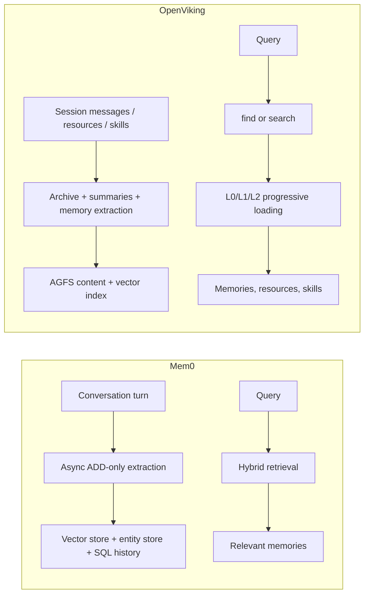

# Mem0 vs OpenViking for Agent Memory Systems

## Executive summary

For most teams that primarily want a **memory layer** rather than a broader context platform, **Mem0 is the stronger default choice**. Its current architecture is purpose-built around additive memory extraction, hybrid retrieval, entity linking, and measured token efficiency; it also has the clearest published benchmark evidence, a managed platform with auto-scaling and audit/governance features, and the larger open-source/community footprint. Official Mem0 materials report substantial gains on LoCoMo, LongMemEval, and BEAM, retrieval token budgets under about 7K tokens per benchmark query, and extraction latency cut roughly in half versus its previous algorithm. The project also ships as both OSS and managed SaaS, with broad SDK/vector-store/model support and a permissive Apache 2.0 license. citeturn42view1turn17view1turn19view0turn39view0turn30view2turn36view0turn37view2

**OpenViking** is compelling when the requirement is not merely “store/retrieve memories,” but rather **run a self-hosted, MCP-native, multi-tenant context database** that unifies **memory, resources, and skills** behind a filesystem-style abstraction. Its architecture is more ambitious and more explicit: L0/L1/L2 progressive summaries, session archives, eight memory categories, built-in MCP, native OAuth 2.1, tenant-aware RBAC, envelope encryption, privacy placeholderization for skill secrets, and first-class Docker/systemd/Helm deployment guidance. In exchange, it is **more operationally complex**, licensed under **AGPLv3** for the main project, and—by its own official “About” page—still in an **early development stage**. Public issues also show some rough edges in long-term-memory timeliness and heavy commit/update workloads. citeturn6view2turn13view0turn11view0turn22search2turn22search1turn9view1turn7search2turn28view0turn26view0turn20search4turn20search2turn20search6turn37view1

The practical recommendation is therefore differentiated. For a **small-scale prototype** or a **managed production deployment**, choose **Mem0**. For a **self-hosted enterprise platform** that needs strong tenancy boundaries, native MCP/OAuth, filesystem-oriented context management, and deep operational visibility, choose **OpenViking**—provided your team is comfortable owning the operational complexity. For a **low-cost local or edge deployment**, **Mem0 OSS** is usually the better fit because its write path is simpler, its provider flexibility is broader, and its current algorithm is materially more token-efficient in published data; OpenViking remains attractive if your edge workload is heavily MCP-centric and benefits from its local `find()`/filesystem model. citeturn39view0turn30view2turn41view0turn41view1turn41view2turn17view1turn22search2turn26view0

## Scope and methodology

I interpret the user’s “**OpeViking**” as **OpenViking**, the official open-source project maintained by Volcengine’s OpenViking team. This report prioritizes official documentation, official GitHub repositories, and other primary sources. Where direct vendor benchmark data is unavailable—especially for OpenViking latency/cost—I provide **explicit model estimates** rather than presenting guesses as measured facts. citeturn6view2turn20search4turn36view3turn36view0

Because no hardware or workload constraints were specified, I assume a **representative single-region deployment** and, for self-hosted modeled estimates, a **single-node 4 vCPU / 16 GB RAM / NVMe SSD machine** with warm caches and a corpus on the order of **100K memory items** unless otherwise noted. I use three workload classes: a **small write** (one short user/assistant turn); a **simple lookup** (retrieve known preference/fact); and a **context-rich agent workload** (multi-turn, memory-grounded answer generation or session-context assembly). These assumptions are mine, but the workload shapes map directly to each system’s official write/read pipelines. citeturn15view0turn15view3turn16view0turn6view2turn9view2turn11view0

## Architecture and memory model

Mem0’s current architecture is intentionally narrow and memory-centric. Official docs describe a two-phase system—**extraction on write, retrieval on read**—with a connecting **entity-linking** layer. On write, conversations are queued asynchronously, related memories are fetched to avoid duplication, a **single-pass ADD-only** LLM extraction produces new facts, new memories are hash-deduplicated and embedded, and entities are linked across memories. On read, retrieval is **multi-signal/hybrid** rather than pure vector similarity, combining semantic, keyword/BM25, entity, and temporal signals. Official migration docs explicitly say the old two-pass extract+merge design was replaced by **single-pass extraction**, and that separate graph memory was replaced by built-in entity linking. citeturn15view0turn42view1turn42view3turn19view1

Mem0’s memory types are documented as **conversation**, **session**, **user**, and **organizational** memory, corresponding roughly to immediate turn state, short-lived episodic task state, long-term personalized state, and shared long-term knowledge. Separate official examples and platform docs also show **agent-scoped memory** via `agent_id`, which matters in practice for role/persona-specific behavior even though the memory-type page itself emphasizes conversation/session/user/org layers. The result is a memory model that is relatively easy to reason about: short-term episodic memory is handled by conversation/session scope, long-term semantic memory by user/org scope, and agent specialization by scoping/metadata rather than a separate grand context ontology. citeturn6view0turn40search2turn40search4turn40search5turn39view0

OpenViking is broader. Official architecture docs define it as a **context database for AI agents**, not merely a memory store. It unifies three context types—**Resource, Memory, Skill**—and layers them over a dual-store architecture: an **AGFS/VikingFS content layer** plus a **vector index**. Memory itself is split into **user memories** and **agent memories**, and session management is a first-class concern rather than a thin wrapper. Session commits create archives, generate structured summaries, extract long-term memories, and write an auditable `memory_diff.json`. Its long-term memory taxonomy is unusually explicit: user memory has **profile, preferences, entities, events**; agent memory has **cases, patterns, tools, skills**. That means OpenViking covers both **episodic/session history** and **semantic/procedural memory** more explicitly than Mem0. citeturn6view2turn9view0turn11view0

OpenViking’s signature architectural idea is its **L0/L1/L2 progressive content model**. Official docs specify L0 abstracts at roughly **100 tokens**, L1 overviews at roughly **1K–2K tokens**, and L2 full detail with no fixed token limit. Retrieval uses a two-stage flow: **intent analysis** generates typed queries when needed, then **hierarchical retrieval** recursively traverses directory structures with reranking. Importantly, simpler `find()` calls skip the LLM-based intent-analysis stage and are explicitly documented as **lower latency** than `search()`. The system therefore spends more effort on routing and progressive loading than Mem0 does, which can be advantageous when agents work across memories, documents, and tools in one namespace. citeturn13view0turn9view2

This yields a crisp architectural distinction. **Mem0 is a specialized agent-memory engine** optimized around write-time fact distillation and read-time ranking efficiency. **OpenViking is a context operating system for agents** in which memory is one subsystem among several. If your scope is principally memory recall/personalization, Mem0 is more direct. If your scope is unified agent context, OpenViking is more expressive. citeturn15view0turn6view2turn9view0turn13view0

## APIs, integrations, and deployment complexity

Mem0 is strong on integration simplicity. Official docs expose a managed **REST API**, Python and JavaScript SDKs, CLI tooling, async clients, OSS REST support, and a cloud-hosted **MCP endpoint** so agents can use memory without local server maintenance. The platform docs emphasize that managed deployments remove provisioning of vector stores, graph/reranker infrastructure, and scaling concerns; the OSS docs show broad pluggability across LLMs, embedders, vector stores, rerankers, and frameworks. Supported OSS vector backends include Qdrant, Chroma, PGVector, Pinecone, Milvus, Redis/Valkey, Elasticsearch/OpenSearch, Weaviate, FAISS, S3 Vectors, Databricks, Turbopuffer, and more; supported LLM/embedding providers include OpenAI, Anthropic, Ollama, Google AI, Together, AWS Bedrock, LM Studio, and others. citeturn39view0turn41view3turn41view0turn41view1turn41view2turn15view2turn4search22

OpenViking’s integration story is in some ways even richer, but less “drop-in.” Official docs show built-in **REST**, Python HTTP SDK, CLI, a native **MCP endpoint** on the same process/port as the REST API, and **native OAuth 2.1** for MCP clients such as Claude.ai, Claude Desktop, ChatGPT, Cursor, and Codex. Verified MCP integrations explicitly include Claude Code, ChatGPT/Codex, Claude.ai/Desktop, Manus, and Trae. OpenViking also publishes 11 MCP tools, including `search`, `read`, `list`, `store`, `add_resource`, `grep`, `glob`, and `forget`, which makes it unusually powerful as a remote context server for coding agents. citeturn22search2turn22search1

On deployment, the gap is wider. Mem0 Platform is the least complex option by far: official docs present it as “production-ready in minutes,” with managed scaling, managed infrastructure, audit logs, governance, and support. Mem0 OSS can run as a library or as a self-hosted server with dashboard and audit logs, but the platform-vs-OSS matrix makes clear that **auto-scaling and HA are built into the platform, not OSS**. OSS users own their own vector DB, LLM, and hosting costs. citeturn39view0turn30view2turn29search16

OpenViking is explicitly designed for self-hosting. Official deployment docs cover bare `openviking-server`, **systemd**, **Docker**, **Docker Compose**, **public Caddy/nginx reverse proxy**, **native HTTPS/OAuth**, and **Kubernetes + Helm**. It supports AGFS backends of **localfs**, **s3fs**, and in-memory storage for testing, and vector backends of **local**, **HTTP remote**, and **Volcengine VikingDB**. This is excellent operational documentation, but it also means more moving parts: API service, console UI, Caddy/reverse proxy, optional OAuth, optional bot, storage backends, and vector index backends. That makes OpenViking more flexible but materially heavier to stand up and run well. citeturn26view0turn25view0turn34view0

Licensing reinforces the operational distinction. Mem0’s main repository is **Apache 2.0**, which is broadly enterprise-friendly. OpenViking’s main project is **AGPLv3**, while some CLI/examples pieces are Apache 2.0. For enterprises worried about copyleft obligations around modifications and network delivery, that difference is strategically significant. citeturn37view2turn37view1

## Performance, token efficiency, and cost

The most important performance fact is that **Mem0 publishes real benchmark numbers**, while **OpenViking primarily publishes observability mechanisms rather than head-to-head benchmarks**. Mem0’s official GitHub/benchmark materials report benchmark retrieval p50s of roughly **0.88s to 1.09s** for LoCoMo, LongMemEval, and BEAM configurations, with around **6.7K–7.0K tokens per query** in those benchmark runs and extraction p50 around **1.0s** on the new platform algorithm. Those numbers are explicitly end-to-end, single-pass, “one retrieval call, one answer” benchmark setups, so they are **not identical to raw search API latency**, but they are still valuable because they measure what many memory-augmented agents actually do. citeturn19view0turn42view1

OpenViking’s official docs do not publish comparable benchmark charts. What they do provide is per-request telemetry, detailed stage timings, and a clear distinction between **fast `find()`** and more expensive **`search()`**. The telemetry guide includes a `search.find` example with **31.2 ms** request duration, **24 tokens** total, and a small vector-search footprint; the retrieval docs state that `find()` avoids session context and LLM intent analysis, whereas `search()` uses LLM intent analysis and is therefore higher latency. This strongly suggests that **simple point lookups in OpenViking can be very fast and very cheap**, but there is no official top-level benchmark comparable to Mem0’s published managed-platform numbers. citeturn6view4turn9view2

Token efficiency is one of Mem0’s clearest advantages in the published record. Official docs say the new algorithm averages **under 7,000 tokens per retrieval call** on key benchmarks, versus **25,000+** tokens for full-context approaches; the migration guide narrows that to roughly **6.8K–7.0K** mean tokens/query for the new platform algorithm. Because Mem0 moved from two LLM passes to one ADD-only pass and offloaded temporal conflict handling to retrieval rather than destructive merges, it simultaneously improved accuracy and reduced extraction latency. citeturn17view4turn42view1turn19view1

OpenViking’s token story is more nuanced. Architecturally, it can be **extremely efficient** on simple reads because L0/L1 allow short summaries, `find()` can avoid LLM intent analysis, and the OpenClaw plugin defaults cap auto-recall injection to **4,000 characters** with a recall limit of **6** items. The L0/L1/L2 design is explicitly about token-budget control. On the other hand, the session pipeline is heavier than Mem0’s write path: `commit()` archives current messages synchronously, then asynchronously generates summaries and extracts long-term memories; because it extracts **eight memory categories** and maintains session archives, it likely consumes more write-side model budget per commit than Mem0’s simpler ADD-only write path. The OpenClaw plugin’s default **20,000 pending-token threshold** before background commit also means that short but important facts may not reach long-term memory quickly unless the plugin or workflow forces commit sooner. citeturn13view0turn11view0turn21search0turn20search2

### Representative workload comparison

| Dimension | Mem0 | OpenViking |
|---|---|---|
| Official benchmark availability | Yes; managed-platform benchmark numbers are published for LoCoMo, LongMemEval, BEAM | No equivalent official benchmark suite found in docs reviewed; telemetry is provided instead |
| Simple lookup path | Raw search latency not prominently benchmarked in official docs reviewed | `find()` is explicitly low-latency and skips LLM intent analysis |
| Complex retrieval path | Hybrid retrieval; official benchmark p50 roughly 0.88–1.09s in end-to-end evaluation | `search()` uses LLM intent analysis + hierarchical retrieval + rerank; official docs say higher latency than `find()` |
| Write path | Async add; queued immediately, background extraction/event tracking | `session.commit()` phase 1 returns quickly; phase 2 summary + extraction runs async unless `wait=true` |
| Token controls | Official benchmark averages about 6.8K–7.0K tokens/query | L0 ~100 tokens, L1 ~1K–2K, L2 on demand; OpenClaw recall injection capped at 4,000 chars by default |
| Compression / serialization | ADD-only facts, hash dedup, entity linking, metadata/timestamps | Session archive summaries, memory diff audit, L0/L1 progressive summaries, eight-category extraction |

The table above is drawn from Mem0’s benchmark/migration docs and OpenViking’s architecture, retrieval, session, telemetry, and OpenClaw-plugin design docs. citeturn19view0turn42view1turn9view2turn11view0turn13view0turn6view4turn21search0

### Cost estimates

There are two very different cost baselines here.

For **Mem0 Platform**, the cleanest primary-source number is the platform subscription itself. Official pricing currently lists **Starter $19/month** for **50K add + 5K retrieval** requests, **Growth $79/month** for **200K add + 20K retrieval**, and **Pro $249/month** for **500K add + 50K retrieval**, with usage-based pricing available by request. On a blended “published tier capacity” basis, that implies an effective cost of roughly **$345–$453 per 1M bundled operations** at the published 10:1 add:retrieval mix. Mem0 does **not** publish a per-GB-month storage price for the managed platform in the materials reviewed; storage appears bundled into platform pricing. citeturn31view1turn31view3

For **self-hosted Mem0**, a useful modeled estimate is to take Mem0’s official benchmark token budget and combine it with current official **OpenAI GPT-5.4 mini** token pricing. At roughly **6.9K input tokens per memory-grounded benchmark query**, **1M such requests** corresponds to about **6.9B input tokens**. At **$0.75 per 1M input tokens**, that is about **$5,175** of input-token cost before answer output tokens; adding a modest **200 output tokens/request** would add about **$900**, for a total around **$6,075 per 1M benchmark-style memory-grounded answer requests**. That is a modeled end-to-end agent-memory estimate, not a raw Mem0 search-API charge. A small-write extraction workload is much cheaper: if one ADD-only extraction averages **300 input + 80 output tokens**, the same GPT-5.4-mini-class model would cost roughly **$585 per 1M small write requests**, plus embeddings and storage. citeturn42view1turn44view0

For **OpenViking**, official docs do not provide a single bundled operational price, because the system is self-hosted and provider-configurable. The official Volcengine pricing docs do at least expose the cost structure for the recommended embedding stack: text embedding is listed at **0.0005 RMB per 1K tokens**. That means simple `find()`-style reads that avoid LLM intent analysis can be extremely cheap in model cost terms: if the average query is only a few dozen tokens, query-embedding cost per million lookups is very low. The expensive paths in OpenViking are not simple retrievals, but **`search()` with intent analysis** and especially **`session.commit()`**, which can invoke summary generation plus long-term-memory extraction across multiple stages. Because official docs disclose the stages but not a canonical price/cardinality benchmark, the fairest statement is that **OpenViking can be cheaper than Mem0 on simple lookups, but write-side cost predictability is poorer because commit cost depends on session size, summary generation, and extraction cadence**. citeturn43search2turn9view2turn11view0turn22search3

For **storage**, neither project’s software cost is the main driver; the driver is the chosen backend. Architecturally, Mem0 stores **vector data + entity store + SQL history**, while OpenViking stores **AGFS content + vector index**, with OpenViking optionally placing AGFS on S3-compatible storage and keeping vectors elsewhere. A reasonable **modeled** self-host range on commodity cloud block/object storage is about **$0.10–$0.20 per logical GB-month** after accounting for metadata, indexes, snapshots, and normal operational overhead. OpenViking can sometimes be slightly more storage-efficient for large document-ish corpora because content and vectors are separated, while Mem0 can be simpler for pure memory facts. These figures are modeling assumptions rather than vendor-published software prices. citeturn15view0turn34view0

## Reliability, consistency, security, and maturity

Both systems are **eventually consistent by design** on writes, but they reach that state differently. Mem0’s `add` endpoint explicitly queues background processing and returns a **PENDING/event ID** rather than blocking until memory extraction completes. That is operationally convenient and reduces request latency, but it means there is a window in which writes have been accepted but are not yet retrievable. The managed platform offsets this with managed infrastructure, audit logs, and governance features. citeturn15view3turn39view0

OpenViking uses a more explicit **two-phase** consistency model for sessions. `commit()` synchronously archives current messages and returns a task ID; summary generation, memory extraction, and `memory_diff.json` happen in the background, with `.done` markers and task polling exposing completion state. The architecture is more transparent than Mem0’s, and the observability story is stronger: `/health`, `/ready`, `/metrics`, `observer`, and telemetry fields provide real troubleshooting leverage. But the design also exposes more reliability surface area. Public issues document that long-term memory in the OpenClaw integration may be delayed by the default **20K commit threshold**, and that under heavy accumulated-memory updates the server can become CPU-bound and stall. Those issues do not mean OpenViking is unusable; they do mean its operational behavior is still actively hardening. citeturn11view0turn22search3turn26view0turn20search2turn20search6

On security and privacy, the two systems excel in different ways. Mem0’s strongest official claims are **compliance-oriented**: the security page states **SOC 2 Type I**, **HIPAA compliance**, an ongoing **SOC 2 Type II audit**, **BYOK**, zero-trust access controls, monitoring, and audit-ready logs. That is valuable for enterprise procurement and regulated use cases. citeturn30view1

OpenViking’s security story is more **architecture-oriented** and unusually explicit. Official docs describe **envelope encryption** with a three-layer key architecture, **per-account keys**, tenant-aware filtering, **ROOT/ADMIN/USER RBAC**, **api_key / trusted / dev** auth modes, **native OAuth 2.1**, and a privacy system that extracts secrets from `SKILL.md`, stores placeholders in content, and restores values at read time. In other words, OpenViking documents concrete storage-isolation and secret-handling mechanisms in more detail than Mem0 does publicly, even though Mem0 makes stronger public compliance claims. citeturn9view1turn28view0turn22search1turn7search2turn7search3

Community and maintenance also favor Mem0, though OpenViking is substantial. Mem0’s GitHub repository shows about **56.3K stars**, **6.4K forks**, **2,191 commits**, and **321 releases**, with the latest release visible on **May 20, 2026**. OpenViking’s repository shows about **24.3K stars**, **1.8K forks**, **1,167 commits**, and **38 releases**, with the latest release visible on **May 15, 2026**. Mem0 also has an associated research paper, while OpenViking’s official “About” page explicitly says the project is in an **early development stage**. On maturity, that matters: Mem0 looks more production-proven overall, especially because the managed platform exists; OpenViking looks energetic and well-documented, but still earlier in its hardening curve. citeturn36view0turn37view2turn36view3turn37view1turn20search4

### Comparison table

| Category | Mem0 | OpenViking |
|---|---|---|
| Primary identity | Memory layer for agents | Context database for agents |
| Core abstraction | Memory records + entity linking | Unified filesystem for memory, resources, skills |
| Short-term memory | Conversation/session layers | Session messages + archives |
| Long-term memory | User/org memory; agent scope via IDs/examples | Explicit user + agent long-term memory trees |
| Write model | Async, ADD-only, one extraction pass | Session commit, summary + extraction phases |
| Retrieval model | Hybrid multi-signal retrieval | `find()` or `search()`, hierarchical retrieval, L0/L1/L2 progressive loading |
| Official published benchmarks | Strong | Limited |
| Managed cloud | Yes | No first-party managed cloud documented in reviewed sources |
| Self-host | Yes | Yes |
| Native MCP | Yes, hosted MCP | Yes, built into server |
| Native OAuth for MCP | Not emphasized in reviewed docs | Yes |
| Multi-tenancy | Platform org/project/workspace controls | Deep account/user/agent isolation model |
| Compliance posture | Strong public enterprise/compliance claims | Strong low-level security architecture documentation |
| License | Apache 2.0 | AGPLv3 for main project |
| Overall production readiness | High, especially managed platform | Medium, promising but earlier-stage |

The table summarizes the repo, architecture, security, and deployment evidence discussed above. citeturn39view0turn15view0turn6view2turn11view0turn13view0turn22search2turn22search1turn28view0turn30view1turn37view2turn37view1turn20search4

## Recommendations

For a **small-scale prototype**, I recommend **Mem0 Platform** unless the prototype is specifically a self-hosted coding-agent context server. The reasons are straightforward: very low integration friction, official managed infrastructure, strong documentation, a cloud MCP endpoint, and the best published benchmark evidence of the two. If the prototype must run fully self-hosted and expose rich MCP tools to coding agents from day one, OpenViking is viable—but that is a narrower case. citeturn39view0turn41view3turn19view0

For a **typical enterprise deployment**, I recommend **Mem0 Platform** if your organization values managed HA, support, compliance messaging, and faster time-to-value. I recommend **OpenViking** instead for an enterprise that has a strong self-hosting mandate, needs deep tenant isolation under its own control, wants native MCP/OAuth for many clients, and is comfortable operating an AGPL-licensed context infrastructure stack. Said differently: **Mem0 is the better productized enterprise buy; OpenViking is the better self-hosted enterprise build.** citeturn30view2turn30view1turn28view0turn22search1turn26view0

For a **low-cost edge or local-first deployment**, I recommend **Mem0 OSS** more often than OpenViking. Its current algorithm is simpler on writes, it supports a wider set of local/model backends, and its published token efficiency is materially better than full-context alternatives. OpenViking’s embedded mode is elegant and its simple `find()` path can be very cheap, but the broader context-database architecture and commit-centric long-term-memory flow generally make it the heavier edge choice unless you specifically want its filesystem/MCP model. citeturn41view0turn41view1turn41view2turn17view4turn26view0turn9view2

**Bottom line:** if you want the better **memory system**, choose **Mem0**. If you want the better **self-hosted agent context platform**, choose **OpenViking**. citeturn15view0turn6view2

## Open questions and limitations

OpenViking does not publish a benchmark suite comparable to Mem0’s in the sources reviewed, so any direct latency/cost comparison beyond simple documented behaviors and telemetry examples necessarily includes modeled assumptions. citeturn6view4turn9view2turn19view0

Mem0’s platform docs currently show some documentation drift around “graph memory”: the platform overview still mentions graph-memory-related features, while the migration guide says the old separate graph memory/dashboard visualization has been replaced by built-in entity linking. For current behavior, I treat the migration guide as more authoritative. citeturn39view0turn42view1

GitHub’s unauthenticated HTML did not expose reliable contributor counts in the pages fetched here, so community analysis uses stars, forks, commits, releases, and visible recent activity as the primary observable proxies. citeturn36view0turn37view2turn36view3turn37view1